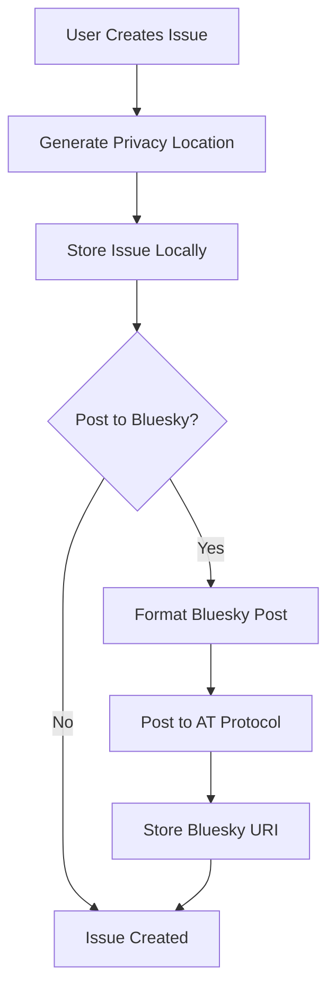

# ATProto Integration and Issue Followup System Design

## Overview

This document outlines the design for integrating Wukkie.uk with the AT Protocol (ATProto) ecosystem, specifically Bluesky, while implementing a privacy-first location system using geo hashtags derived from Plus Codes.

## Privacy-First Location System

### Geo Hashtag Format

Instead of storing precise GPS coordinates, we use privacy-friendly geo hashtags:

```
Format: #geo[6-character-code]
Example: #geo9c3xgp
Coverage: ~1.1km x 0.9km area
```

### Plus Code Integration

```javascript
// Convert GPS to privacy location
const location = createPrivacyLocation(51.5074, -0.1278, 'Central London');
// Returns: { geoHashtag: '#geo9c3xgp', label: 'Central London', ... }
```

**Privacy Benefits:**
- No exact coordinates stored or transmitted
- ~1km² precision prevents doxxing
- User can add optional human-readable labels
- Compatible with offline navigation systems

### Location Data Structure

```typescript
interface PrivacyLocation {
  geoHashtag: string;        // #geoXXXXXX format
  label?: string;            // Optional human label
  plusCode: string;          // Full plus code for reference
  centerLat: number;         // Approximate center
  centerLng: number;         // Approximate center
  precision: number;         // Area size in km
}
```

## ATProto Integration Architecture

### Custom Lexicon Schema

```json
{
  "lexicon": 1,
  "id": "uk.wukkie.issue",
  "defs": {
    "main": {
      "type": "record",
      "description": "A public issue report with privacy-friendly location",
      "key": "tid",
      "record": {
        "type": "object",
        "required": ["title", "description", "location", "category", "createdAt"],
        "properties": {
          "title": {
            "type": "string",
            "maxLength": 200,
            "description": "Issue title"
          },
          "description": {
            "type": "string",
            "maxLength": 2000,
            "description": "Detailed issue description"
          },
          "location": {
            "type": "object",
            "required": ["geoHashtag"],
            "properties": {
              "geoHashtag": {
                "type": "string",
                "pattern": "^#geo[23456789cfghjmpqrvwx]{6}$",
                "description": "Privacy-friendly geo hashtag"
              },
              "label": {
                "type": "string",
                "maxLength": 100,
                "description": "Optional location label"
              },
              "precision": {
                "type": "number",
                "description": "Area precision in kilometers"
              }
            }
          },
          "category": {
            "type": "string",
            "enum": ["infrastructure", "environment", "safety", "transport", "community", "other"]
          },
          "priority": {
            "type": "string",
            "enum": ["low", "medium", "high", "critical"],
            "default": "medium"
          },
          "status": {
            "type": "string",
            "enum": ["open", "in_progress", "resolved", "closed"],
            "default": "open"
          },
          "hashtags": {
            "type": "array",
            "items": {"type": "string"},
            "description": "Subject hashtags"
          },
          "externalUri": {
            "type": "string",
            "description": "Link to full issue on wukkie.uk"
          }
        }
      }
    }
  }
}
```

### Bluesky Post Strategy

#### Primary Issue Post
```
🚨 New Issue: [Title]

[Description]

📍 #geo9c3xgp (Central London)

#wukkie #infrastructure #streetlight

Full details: https://wukkie.uk/issue/[id]
```

#### Features:
- Rich text with proper facets for hashtags and links
- Geo hashtag for location-based discovery
- Category and subject hashtags
- Link back to full issue page
- Optional media attachments (up to 4 images)

### Issue Data Structure

```typescript
interface WukkieIssue {
  id: string;                    // Unique identifier
  title: string;                 // Issue title
  description: string;           // Detailed description
  category: IssueCategory;       // Primary category
  priority: IssuePriority;       // Urgency level
  status: IssueStatus;           // Current status
  location: PrivacyLocation;     // Privacy-friendly location
  hashtags: string[];            // Subject hashtags
  media?: Blob[];                // Optional photos/media
  createdAt: string;             // ISO timestamp
  updatedAt?: string;            // Last update timestamp
  author: string;                // Creator DID/handle
  
  // ATProto integration
  blueskyUri?: string;           // AT-URI of main post
  blueskyReplyUri?: string;      // AT-URI for thread replies
  
  // Engagement tracking
  views?: number;                // View count
  boosts?: number;               // Bluesky reposts
  replies?: number;              // Reply count
}
```

## Bluesky Integration Workflow

### Issue Creation Flow



### Implementation

```typescript
class ATProtoIssueManager {
  async createIssue(
    issue: Omit<WukkieIssue, 'id' | 'createdAt'>,
    postToBluesky: boolean = true,
    options: BlueskyPostOptions = {}
  ): Promise<WukkieIssue> {
    // 1. Generate unique ID and timestamp
    const newIssue = {
      ...issue,
      id: generateIssueId(),
      createdAt: new Date().toISOString()
    };
    
    // 2. Store locally
    await this.storeIssue(newIssue);
    
    // 3. Post to Bluesky if requested
    if (postToBluesky && this.isAuthenticated()) {
      const blueskyUri = await this.postToBluesky(newIssue, options);
      newIssue.blueskyUri = blueskyUri;
      await this.updateIssue(newIssue);
    }
    
    return newIssue;
  }
}
```

## Search and Discovery System

### Location-Based Discovery

```typescript
// Search by geo hashtag
const nearbyIssues = await searchIssues({
  geoHashtags: ['#geo9c3xgp', '#geo9c3xgq', '#geo9c3xgr']
});

// Search within radius using nearby hashtags
const proximitySearch = await searchIssues({
  nearLocation: currentLocation,
  radius: 2 // kilometers
});
```

### Hashtag Indexing

Issues are indexed by multiple hashtag types:
- **Location hashtags**: `#geo9c3xgp`
- **Category hashtags**: `#infrastructure`, `#environment`
- **Subject hashtags**: `#pothole`, `#streetlight`
- **System hashtags**: `#wukkie`

### Bluesky Search Integration

```typescript
// Search Bluesky for location-specific issues
const blueskyResults = await agent.app.bsky.feed.searchPosts({
  q: '#geo9c3xgp #wukkie',
  limit: 25
});
```

## Issue Followup System

### Threading Strategy

Each issue creates a potential discussion thread:

1. **Root Post**: Original issue
2. **Status Updates**: Posted as replies to root
3. **Community Replies**: Natural Bluesky threading
4. **Resolution**: Final status update

### Update Workflow

```typescript
async updateIssue(
  issue: WukkieIssue,
  updates: Partial<WukkieIssue>,
  postUpdate: boolean = true
): Promise<WukkieIssue> {
  // Update local issue
  const updatedIssue = { ...issue, ...updates, updatedAt: new Date().toISOString() };
  await this.storeIssue(updatedIssue);
  
  // Post update to Bluesky thread
  if (postUpdate && issue.blueskyUri) {
    await this.postFollowUp(updatedIssue, generateUpdateMessage(updates));
  }
  
  return updatedIssue;
}
```

### Follow-up Post Format

```
📄 Issue Update: [Title]

Status: resolved ➜ closed
Priority: medium ➜ low

The streetlight has been fixed! Thanks to everyone who reported this.

#geo9c3xgp #infrastructure #resolved

View: https://wukkie.uk/issue/[id]
```

## Data Storage Strategy

### Local Storage (Client-Side)

```javascript
// Store issues in localStorage for offline access
localStorage.setItem('wukkie_issues', JSON.stringify(issues));

// Cache Bluesky auth tokens
localStorage.setItem('wukkie_bluesky_session', JSON.stringify(session));
```

### Future: Distributed Storage

- **IPFS Integration**: Store issue content on IPFS
- **AT Protocol Records**: Use AT-URI for canonical references
- **Local-First**: Sync across devices while maintaining offline capability

## Privacy and Security Considerations

### Location Privacy
- ✅ Only 6-character geo codes stored (~1km precision)
- ✅ No precise GPS coordinates in posts or storage
- ✅ User controls location labels and sharing
- ✅ Compatible with Tor/privacy browsers

### Authentication
- ✅ OAuth 2.0 with Bluesky
- ✅ No password storage
- ✅ Session management with refresh tokens
- ✅ Optional anonymous issue reporting

### Data Minimization
- Only essential data stored
- User controls Bluesky posting
- Issues can be deleted locally
- No tracking or analytics by default

## Implementation Phases

### Phase 1: Core Privacy System ✅
- [x] Plus Code geo hashtag generation
- [x] Privacy location interface
- [x] Local issue storage
- [x] Basic UI integration

### Phase 2: ATProto Integration
- [ ] Bluesky OAuth implementation
- [ ] Issue posting to AT Protocol
- [ ] Custom lexicon deployment
- [ ] Thread management system

### Phase 3: Discovery and Search
- [ ] Location-based issue filtering
- [ ] Hashtag search system
- [ ] Bluesky cross-platform search
- [ ] Nearby issue discovery

### Phase 4: Community Features
- [ ] Issue status updates
- [ ] Community voting/validation
- [ ] Follow-up discussion threading
- [ ] Media attachment support

### Phase 5: Advanced Features
- [ ] Government API integration
- [ ] Notification system
- [ ] Mobile PWA optimization
- [ ] Multi-language support

## API Endpoints (Future Backend)

```typescript
// REST API design for future backend
interface WukkieAPI {
  // Issues
  GET    /api/issues                    // List issues with filters
  POST   /api/issues                    // Create new issue
  GET    /api/issues/:id                // Get specific issue
  PUT    /api/issues/:id                // Update issue
  DELETE /api/issues/:id                // Delete issue
  
  // Search
  GET    /api/search/location/:geohash  // Search by geo hashtag
  GET    /api/search/nearby/:lat/:lng   // Search by coordinates
  GET    /api/search/hashtags/:tags     // Search by hashtags
  
  // ATProto
  POST   /api/bluesky/auth              // Bluesky OAuth flow
  POST   /api/bluesky/post              // Post to Bluesky
  GET    /api/bluesky/search            // Search Bluesky posts
}
```

## Success Metrics

### Privacy Goals
- Zero precise location data stored
- User adoption of geo hashtag system
- No privacy breaches or location leaks

### Engagement Goals
- Issues posted to Bluesky for wider reach
- Community engagement through threaded discussions
- Cross-platform discovery and resolution

### Technical Goals
- Sub-second geo hashtag generation
- Reliable ATProto integration
- Offline-first functionality maintained

## Conclusion

This design creates a privacy-first, federated issue reporting system that:

1. **Protects Privacy**: Uses ~1km geo hashtags instead of precise coordinates
2. **Enables Discovery**: Hashtag-based search and filtering
3. **Facilitates Discussion**: Bluesky integration for community engagement
4. **Maintains Autonomy**: Local-first with optional social sharing
5. **Scales Globally**: Built on open protocols and standards

The system balances the need for location-based issue reporting with user privacy, while leveraging the decentralized AT Protocol for broader community engagement and issue resolution.